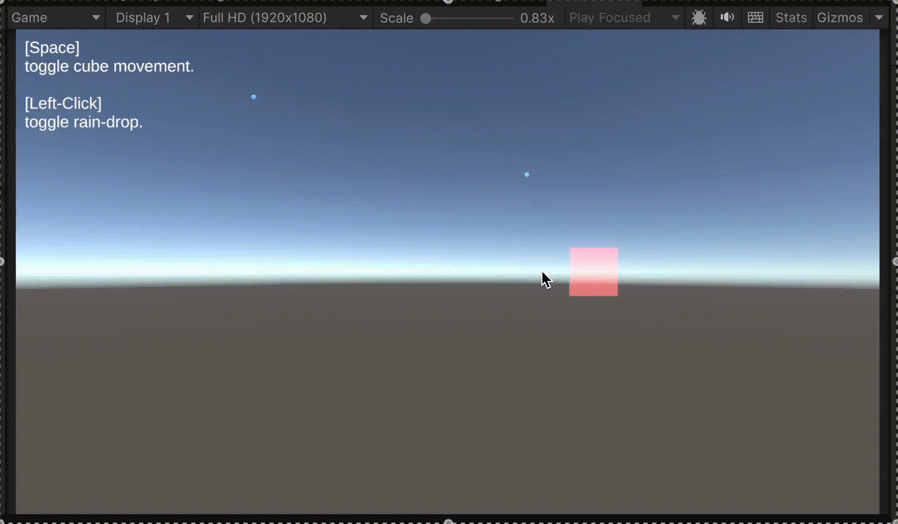
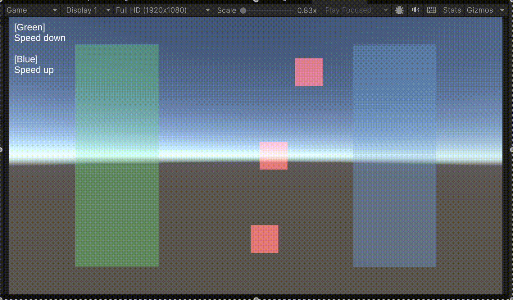

# Time Channels for Unity

[](https://unity.com)
[](https://opensource.org/licenses/MIT)

A lightweight and highly controllable time channel system for Unity — designed to replace Unity's global `Time.timeScale` with modular, per-system control.

## Why Not Use `Time.timeScale`?

Unity's built-in `Time.timeScale` affects the entire game globally, which limits your ability to create nuanced time effects. For example, you can't easily:

- Pause UI while gameplay continues
- Slow down enemies without affecting player controls  
- Run multiple independent timelines in parallel

`Time Channels` solves these problems by allowing each gameplay system to operate on its own independently scaled timeline.

## ✨ Features

- **Per-System Time Scaling**: Assign unique time scales to players, enemies, weather, UI, and more
- **Modular Architecture**: Clean separation of channel creation, management, and usage
- **String-Based Channel Naming**: Easily register and retrieve custom time channels by name
- **Pause/Resume Per Channel**: Control specific systems without impacting the entire game
- **Event System**: React to time scale changes with `OnTimeScaleChanged` callbacks
- **Flexible Signal System**: Use `TimeChannelSignal` for complex, dynamic time effects

## 📦 Installation

### Via Git URL

1. Open **Window > Package Manager**
2. Click the **+** button and select **"Add package from git URL"**
3. Enter: `https://github.com/bcoffee0630/game-core-time-channels.git`
4. Click **Add**

### Requirements

- Unity 2019.4 or newer
- No additional dependencies

## 🚀 Quick Start

### 1. Register a time channel

```csharp
TimeChannelManager.Register("Player", SupportedTime.DeltaTime);
```

### 2. Access time in your Update loop

```csharp
float dt = TimeChannelManager.Get("Player").DeltaTime;
transform.Translate(Vector3.forward * speed * dt);
```

### 3. Adjust time scale at runtime

```csharp
TimeChannelManager.Get("Player").TimeScale = 0.5f; // Slow motion effect
```

## 📖 Usage Examples

### Create a custom time channel without the manager

```csharp
var customChannel = TimeChannelFactory.Create(SupportedTime.FixedDeltaTime);
customChannel.TimeScale = 0.8f;
float dt = customChannel.DeltaTime;
```

### Pause and resume a specific channel

```csharp
var enemy = TimeChannelManager.Register("Enemy", SupportedTime.DeltaTime);

// Pause: set scale to 0 (remember previous scale if you need to restore it)
float prevScale = enemy.TimeScale;
enemy.TimeScale = 0f;

// Resume: restore previous scale
enemy.TimeScale = prevScale;
```

> **Note:** `TimeChannel` has no built-in `Pause()`/`Resume()` methods. Pausing is done by setting `TimeScale` to `0f`, and resuming by restoring a non-zero scale.

### Use TimeChannelSignal for advanced effects

```csharp
public class MovingCube : MonoBehaviour
{
    [SerializeField] private TimeChannelSignal signal;
    
    void Update()
    {
        if (signal.Channel != null)
        {
            float dt = signal.Channel.DeltaTime;
            // Use dt for movement, animation, etc.
        }
    }
}
```

### React to time scale changes

```csharp
var channel = TimeChannelManager.Get("Player");
channel.OnTimeScaleChanged += (newScale) => {
    Debug.Log($"Player time scale changed to: {newScale}");
    // Update UI, play effects, etc.
};
```

## 📚 API Overview

| Component | Description |
|-----------|-------------|
| `TimeChannelManager` | Register, retrieve, and manage named time channels |
| `TimeChannel` | Core time channel with `DeltaTime`, `TimeScale`, and events |
| `TimeChannelFactory` | Create custom time channels independent of the manager |
| `TimeChannelSignal` | MonoBehaviour component for advanced time control |
| `SupportedTime` | Enum defining Unity's built-in time types |

### Core Methods

```csharp
// TimeChannelManager
TimeChannel Register(string name, SupportedTime type, float defaultTimeScale = 1f)
TimeChannel Get(string name)
bool Has(string name)
void Unregister(string name)
void Clear()

// TimeChannel  
float DeltaTime { get; }
float TimeScale { get; set; }
SupportedTime Type { get; }
event Action<float> OnTimeScaleChanged
```

## 🧪 Samples

The package includes two comprehensive samples:

- **BasicExample**: Demonstrates fundamental usage of time channels
- **TimeControlExample**: Shows `TimeChannelSignal` with trigger-based time effects

**To import samples:**

1. Open **Window > Package Manager**
2. Select `Time Channels`  
3. Click the **Samples** tab
4. Import the desired sample

## 🎥 Demo


*Basic time channel control with pause/resume functionality*

  
*Advanced time effects using TimeChannelSignal*

## ⚠️ Best Practices

- **Avoid mixing with global Time.timeScale** - Don't use Unity's global `Time.timeScale` alongside this system
- **Register channels early** - Register all channels in `Awake()` or `Start()`
- **Use descriptive names** - Choose meaningful channel names like "Player", "Enemies", "Weather"
- **Clean up properly** - Call `TimeChannelManager.Unregister()` when channels are no longer needed
- **Handle null references** - Always check if channels exist before using them

## 🔄 Changelog

### [1.1.0] - 2025-08-02
- Added `OnTimeScaleChanged` event to `TimeChannel`
- Added `TimeChannelSignal` for flexible time control
- Modified `TimeChannelManager.Register` to return existing channels
- Renamed `timeScale` parameter to `defaultTimeScale`

### [1.0.0] - 2025-07-06
- Initial release
- Core time channel system
- Manager and factory classes
- Basic sample scenes

## 🤝 Contributing

Contributions are welcome! Please feel free to submit a Pull Request.

### Development Setup

1. Fork this repository
2. Clone your fork: `git clone https://github.com/your-username/game-core-time-channels.git`
3. Create a feature branch: `git checkout -b feature/amazing-feature`
4. Make your changes and commit: `git commit -m 'Add amazing feature'`
5. Push to the branch: `git push origin feature/amazing-feature`
6. Open a Pull Request

## 📄 License

MIT License © 2025 [Bcoffee](https://github.com/bcoffee0630)

See [LICENSE](LICENSE) for more details.

## 🐛 Issues & Support

If you encounter any issues or have questions:

1. Check the [Issues](https://github.com/bcoffee0630/game-core-time-channels/issues) page
2. Create a new issue with detailed information
3. Include Unity version, error messages, and reproduction steps

---

⭐ If this project helps you, please consider giving it a star!
